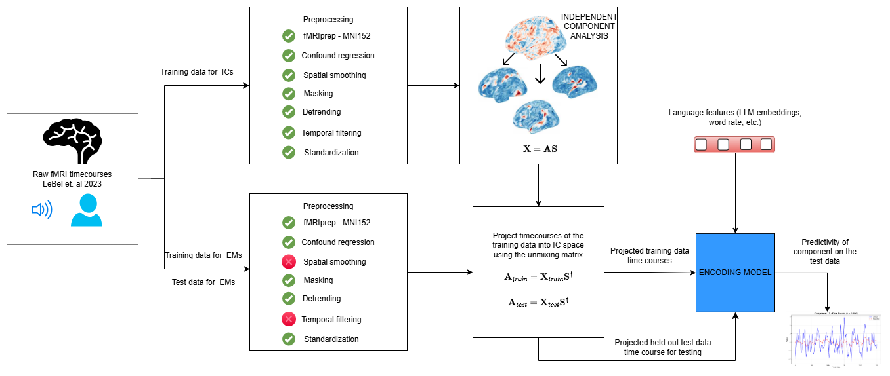

# IC-EMs: Independent Component–Based Encoding Models

Code for **"Independent-Component-Based Encoding Models of Brain Activity During Story Comprehension"** (Hari et al., 2026), to be published in CCN Proceedings (2026).


*Figure 1 from the paper. fMRI data are decomposed using subject-specific spatial ICA, then encoding models are trained to predict component timecourses from LLM representations of linguistic input.*

---

## Overview

We build encoding models that predict brain responses at the level of functional networks identified by ICA, rather than individual voxels or predefined ROIs. The pipeline has five stages:

1. **Preprocessing** : fMRIPrep + custom cleaning (two variants: ICA and encoding)
2. **ICA** : spatial ICA via `parcellate` (see below)
3. **ICA-AROMA** : noise component labeling
4. **Projection** : project BOLD data into IC space
5. **Encoding models** : ridge regression on component timecourses using LLM embeddings

---

## Data

We use the [LeBel et al. (2023)](https://doi.org/10.1038/s41597-023-02437-z) dataset: 8 subjects listening to 26 naturalistic stories from *The Moth Radio Hour*.

Download from OpenNeuro: [ds003020](https://openneuro.org/datasets/ds003020)

---

## Setup

```bash
git clone https://github.com/kamyahari/IC-Encoding-Models.git
cd IC-Encoding-Models
pip install -r requirements.txt
```

**Note on `parcellate`: This repo includes a local copy (`parcellate/`) with modifications to expose ICA components needed for downstream steps. Use it directly. Code credits to Dr. Cory Shain (Link to original repo: https://github.com/coryshain/parcellate.git)

**LITcoder** must be installed separately, please find instructions at :https://github.com/GT-LIT-Lab/litcoder_core.git

**ICA-AROMA** must also be installed separately. Follow the ICA-AROMA installation instructions at : https://github.com/maartenmennes/ICA-AROMA.

---

## Pipeline

### Step 0 : fMRIPrep

Run fMRIPrep on the LeBel dataset. Two variants are needed:

| Variant | Slice-time correction | Used for |
|---|---|---|
| ICA | **Yes** | Steps 1a, 2 |
| Encoding | **No** | Steps 1b, 4 |

```bash
# Example sbatch (adjust paths in preprocessing/preprocess_array.sbatch)
bash preprocessing/submit_preprocessing.sh ica
bash preprocessing/submit_preprocessing.sh encoding
```

Set all `# TODO` paths in `preprocessing/preprocess_array.sbatch` before running.

---

### Step 1 : Preprocessing

Two Python scripts handle post-fMRIPrep cleaning. Both apply:
- TR trimming (first/last 10 TRs)
- Confound regression (motion params, aCompCor, global signal, cosine drift, spike regressors for FD > 0.5)
- Detrending and standardization

The **ICA** variant additionally applies spatial smoothing (4 mm FWHM) and bandpass filtering (0.01–0.1 Hz). The **encoding** variant does not, preserving high-frequency information.

```
preprocessing/preprocess_ica.py       # ICA estimation data
preprocessing/preprocess_encoding.py  # Encoding model data
```

Both are called automatically by the sbatch scripts above.

---

### Step 2 : ICA (parcellate)

Run spatial ICA on the 3 ICA-estimation stories per subject using the config templates in `config/subjects/`.

```bash
# Copy and fill in the template for each subject
cp config/subjects/template_ICA.yml config/subjects/sub-UTS01_ICA.yml
# Edit sub-UTS01_ICA.yml: set output_dir, mask_path, and functional_paths

# Run parcellate
python -m parcellate.bin.train config/subjects/sub-UTS01_ICA.yml
```

This produces (in your `output_dir/sub-UTS01/sample/main/`):
- `ica_model.joblib` : full ICA model (access via `m.mixing_`, `m.components_`)
- `ica_mixing_main.npy` : mixing matrix
- `spatial_maps_4d_resampled.nii.gz` : 4D spatial component maps

To compare additional atlases, add them under `label.main.reference_atlases` in the config before running.

---

### Step 3 : ICA-AROMA

Label noise components using ICA-AROMA. We use it in classification-only mode (`-den no`). Components are labeled but not removed, so all 100 are retained for encoding model analysis.

**3a. Prepare AROMA inputs** (mixing matrix, FT mixing, spatial maps in melodic format):

```bash
python ica/prepare_aroma.py sub-UTS01
```

Set the `# TODO` paths at the top of `ica/prepare_aroma.py`. The script will also print the exact `ICA_AROMA.py` command to run for that subject.

**3b. Run ICA-AROMA** (from your AROMA directory):

```bash
python ICA-AROMA/ICA_AROMA.py \
  -o /path/to/output/sub-UTS01/ICA_AROMA_output \
  -m /path/to/parcellate/sub-UTS01/mask.nii.gz \
  -mc /path/to/aroma/sub-UTS01/sub-UTS01_motion.par \
  -md /path/to/aroma/sub-UTS01/ICA_AROMA_out/melodic.ica \
  -w /path/to/mni2009_to_fslmni152_warp.nii.gz \
  -tr 2.0 \
  -den no
```

Add `--overwrite` if rerunning into an existing output directory.
Also attached the warp used for this transformation between standard spaces at ica/mni2009_to_fslmni152_warp.nii.gz. If you're working
in the subject space and want to create your own warps, you can create so using [FSL](https://fsl.fmrib.ox.ac.uk/fsl/docs/)

---

### Step 4 : Split ICA Components

Split the 4D spatial maps into individual 3D volumes for atlas matching:

```bash
python labeling/split_components.py sub-UTS01
```

Set `PARCELLATE_OUT` at the top of the script. Outputs one `ICA_component_NN.nii.gz` per component.

**Optionally rank components** against a reference atlas:

```bash
python labeling/rank_ics.py \
    parcellate/resources/DU15_LANG.nii.gz \
    /path/to/sub-UTS01/sample/main/ICAComponents/ \
    --mask /path/to/sub-UTS01/mask.nii.gz \
    --out sub-UTS01_LANG_rankings.csv
```

---

### Step 5 : Project Data to IC Space

Project all encoding model BOLD files into IC space using the ICA mixing matrix:

```bash
# Set PREPROCESSED_BASE, PARCELLATE_OUT, OUTPUT_BASE in ica/project_components.py
sbatch ica/submit_projection.sh
# or run directly:
python ica/project_components.py 0   # 0 = sub-UTS01
```

Output: one `.npy` file per story per subject, shape `(n_components, n_timepoints)`.

---

### Step 6 : Train Encoding Models

Open and run `encoding/train_encoding_models.ipynb`. The notebook trains ridge regression encoding models using Pythia-410M embeddings as features and IC timecourses as targets, then evaluates on the held-out test story (`wheretheressmoke`).

---

## Citation

```bibtex
@misc{hari2026independentcomponentbasedencodingmodelsbrain,
      title={Independent-Component-Based Encoding Models of Brain Activity During Story Comprehension}, 
      author={Kamya Hari and Taha Binhuraib and Jin Li and Cory Shain and Anna A. Ivanova},
      year={2026},
      eprint={2604.24942},
      archivePrefix={arXiv},
      primaryClass={cs.CL},
      url={https://arxiv.org/abs/2604.24942}, 
}
```
